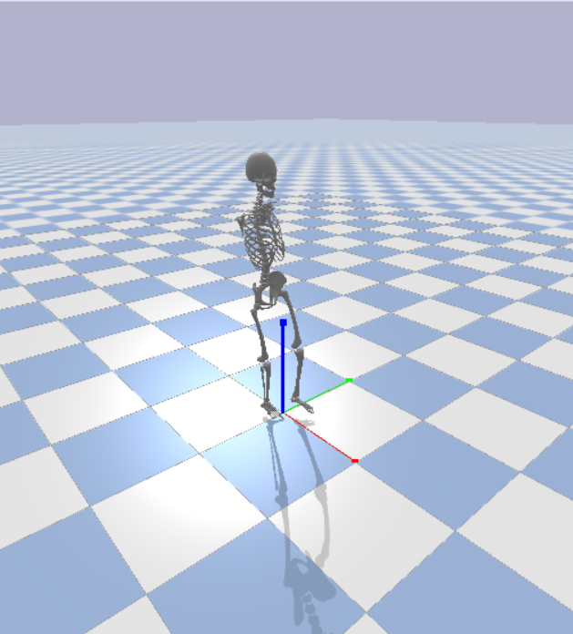

An environment is built for a 6 degree of freedom Skeleton and you can use this env to make your own models or train a RL controller for your model. You can design any robot with any shape for any application, just follow the instructions please.




### Make your own model
Make your own URDF file.
first you need to design your model cad in a software like SolidWorks. Then add this extension "https://github.com/ros/solidworks_urdf_exporter/releases" to your SW and export the URDF file from SW. You can watch this video for more details: "https://www.youtube.com/watch?v=Id8zVHrQSlE"

### Start coding
Firstly, clone the repository and make a virtual env to install required packages.
```
git clone https://github.com/Parham-Ahmadpanah/Skeleton-Pybullet
cd Skeleton-Pybullet
conda create --name Bullet_env python=3.9.19
conda activate Bullet_env
```
Install the dependancies.
```
conda install conda-forge::pybullet
pip install -r requirements.txt
```
You can run the main.py now and test whether the program works correctly. For changing the model, you need to modify the address of the URDF file in this line and the     get_observation_space(self) class with your desired lower and upper limit for observation space.

### Gait Cycle for initial control of robot
To train your skeleton, you can use the gait cycle. I used the data from "Side to side kinematic gait differences ..." by P. Ismailidisa et al. (2021) and made a gait cycle for ankle, knee, and hip function. By using "gait.py" in the repository, you can enter the percentage of right foot gait cycle to the function and it will give you 6 degrees of the joints.(Ankle, knee, and foot for each leg) 

### Control your model
To make your model dynamically stable, you need to increase the number od DOF, however consider the harder training process. Design 2 classes of get_reward function and is_done function based on your knowledge and experience of the model you designed.


